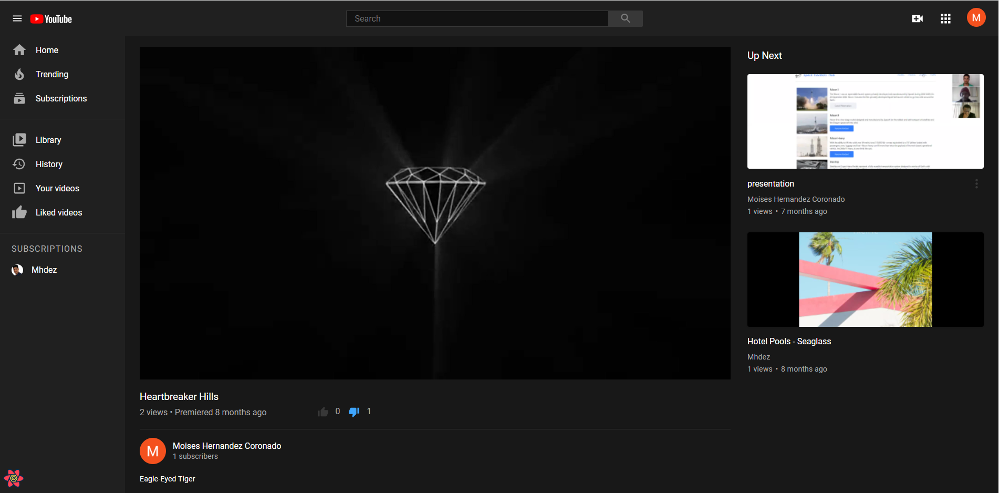

# YouTube Clone

This is my own youtube version. A fully functional application, that allows you upload videos and songs.
You can like, comment and subscribe to others' uploads



## [Go Live](https://mhdez-youtube.herokuapp.com/)

## Project Setup

1. Upon cloning this repo, add your node version in the "engines" section of the root package.json file.

- You can find out your node version by running the command `node -v` in your terminal.

2. Install dependencies for package.json files for server (in root of project) and for client (in "client" folder)

```bash
npm install
cd client && npm install
```

3. In the root folder genrate migrations

```
npm run generate
```

3. Run dev script in project root to run both server and client scripts simultaneously.

- Note: Make sure you are not in the "client" folder

```bash
npm run dev
```

## Add remote heroku

```bash
heroku git:remote -a mhdez-youtube
```

## Global Dependencies Required

- [Node 10+](https://node.js.org)
- [NPM 5+](https://node.js.org)
- [Git](https://git-scm.com/)

## Accounts Required

- [Heroku Account](https://signup.heroku.com/)
- [Google Account](https://accounts.google.com/signup/v2/webcreateaccount?service=mail)

## Recommended Tools

- [VS Code](https://code.visualstudio.com)
- [Insomnia Core](https://insomnia.rest/)
- [Google Chrome](https://www.google.com/chrome/)

## Extensions for VSCode

- [Prettier](https://marketplace.visualstudio.com/items?itemName=esbenp.prettier-vscode)
- [Prisma](https://marketplace.visualstudio.com/items?itemName=Prisma.prisma)

## Helpful Links

- [Google Developer Console](https://console.developers.google.com/)
- [Prisma Docs](https://prisma.io)
- [Cloudinary Documentation](https://cloudinary.com/documentation/)

## Author

👤 **Moises Hernandez**

- GitHub: [@Mhdez221993](https://github.com/Mhdez221993)
- Twitter: [@MoisesH42060050](https://twitter.com/MoisesH42060050)
- LinkedIn: [Moises Hernandez Coronado](https://www.linkedin.com/in/moises-hernandez-9bbb17145/)

## Contributing

Contributions, issues, and feature requests are welcome!

Feel free to check the [issues page](https://github.com/Mhdez221993/youtube/issues)

## Show your support

Give a ⭐️ if you like this project!

## Acknowledgments

- To my coding partner who helped me through all the work
- To my Stand Up Team who kept my morale up!
